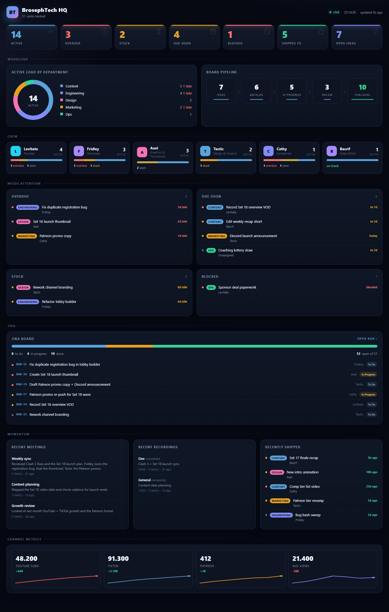
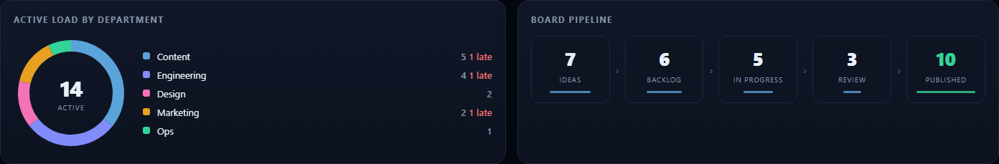
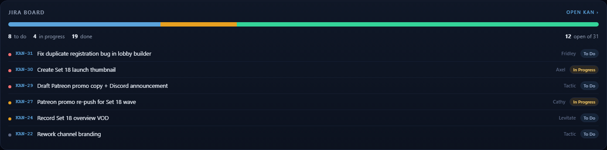

# BrosephTech Bot — User Guide

The BrosephTech bot keeps the crew's work moving. It records voice meetings and
turns them into tasks, holds owners accountable for the content board, and gives
you a live command center for everything in Discord and the browser.

There's a prettier version of this guide at `docs/index.html` (open it in a
browser, or the bot serves it at `http://<host>:<port>/docs`).



---

## 1. Record a meeting → tasks (`/record`)

This is the headline feature. Talk in a voice channel, and the bot writes the
tasks for you.


**Steps:**
1. Join a voice channel.
2. Run **`/record start`**. The bot joins and starts capturing. Each person is
   recorded on their own track, so a long call is never cut off after a pause.
3. Talk normally. Run **`/record status`** any time to see who's been heard.
4. Run **`/record stop`** (optionally `/record stop title:Weekly sync`).

**What you get back:**
- A short **AI summary** of the meeting (what was discussed, decisions, owners).
- A **checklist of suggested tasks**, each with a department, priority, and owner.
- The **full transcript attached as a file** (the embed only previews it).

**Then:** tick the tasks that are real in the dropdown and hit **Create
selected**. Each one becomes a **board card** and (if Jira is connected) a **Jira
issue** in `KAN`, with a link back. Hit **Discard** to throw the suggestions away.

> Transcription runs **locally** with whisper.cpp on the GPU — audio never leaves
> the machine. The summary and task extraction use the Claude API.

**Other `/record` commands:**
- `/record status` — is a recording running, for how long, who has spoken.
- `/record jiracheck` — verify the Jira connection.

---

## 2. The dashboard

Two views of the same live snapshot.

### In Discord: `/dashboard`
Posts a command-center embed — active / overdue / stuck / due-soon / blocked /
shipped counts, department health, who's behind, blocked items, recent meetings
and recordings, Jira status, and channel metrics. Has a **Refresh** button.

### In the browser
A dark, auto-refreshing (every 20s) web dashboard the bot serves itself. Open:
```
http://<host>:<port>/?k=YOUR_DASHBOARD_TOKEN
```
The token is stored in a cookie after the first visit. What's on it:

| Section | Shows |
|---|---|
| KPI row | active, overdue, stuck, due soon, blocked, shipped this week, open ideas |
| Active load by department | donut split of active work per department |
| Board pipeline | card counts across Ideas → … → Published |
| Crew | each member's active / overdue / stuck / due-soon load |
| Needs attention | overdue, due-soon, stuck, and blocked cards |
| Jira board | to-do / in-progress / done bar + open issues with links |
| Momentum | recent meetings, recordings, and recently shipped |
| Channel metrics | YouTube / TikTok / Patreon / avg views with trend sparklines |




> Tip: add `&demo=1` to the URL to preview the dashboard with sample data.

---

## 3. Channel metrics (`/metrics`)

Track growth so the dashboard's metrics + sparklines fill in over time.

- `/metrics log yt:48200 tiktok:91300 patreon:412 avgviews:21400` — record today's
  numbers. Any channel you leave out carries forward from the last entry, so a
  partial update never looks like a drop to zero.
- `/metrics show` — the latest numbers with deltas vs the previous snapshot.

---

## 4. The board & accountability

The bot reads and writes the shared content board (`bt_content_cards`).

- `/board` — board health summary (totals + per-department counts).
- `/card add` — create a card (title, department, assignee, priority, due date).
- `/mytasks` — your own active / overdue / stuck / due-soon cards.
- `/scorecard` — a crew member's accountability scorecard.
- `/blocked` — every blocked card that still needs unblocking.
- `/standup` — post the standup snapshot now (Manage Server only).
- `/digest` — post the weekly digest now.
- `/meeting` — capture a meeting from **pasted notes** (the text version of
  `/record`).

It also runs on a schedule: a daily standup, a weekly digest, blocked-card
sweeps, and nudges to owners of overdue / stuck / due-soon work. New cards,
ships, and blocks are announced live in the HQ channels.

---

## 5. Setup (one-time)

All config lives in `bt-bot/.env`. The bot must be restarted to pick up changes.

| What | Key(s) | Needed for |
|---|---|---|
| Discord | `BT_DISCORD_TOKEN`, `BT_CLIENT_ID`, `BT_GUILD_ID` | the bot to run |
| Board (Supabase) | `SUPABASE_URL`, `SUPABASE_SERVICE_ROLE_KEY` | the board |
| AI summaries/tasks | `ANTHROPIC_API_KEY` | good `/record` + `/meeting` output |
| Local transcription | `WHISPER_CMD`, `WHISPER_MODEL` | `/record` audio → text |
| Jira push | `JIRA_BASE_URL`, `JIRA_EMAIL`, `JIRA_API_TOKEN`, `JIRA_PROJECT_KEY` | tasks → Jira |
| Web dashboard | `DASHBOARD_TOKEN` | the browser dashboard |

Register the slash commands once (and after adding commands):
```
npm run deploy
```
Start the bot:
```
npm start
```
On boot it prints a voice dependency report and the dashboard URL. If the voice
report shows opus/encryption "not found", recording would be silent.

---

## 6. Troubleshooting

- **`/record start` says "Could not connect … timed out".** The voice library
  must be current (`@discordjs/voice` ≥ 0.19). Run `npm install` and restart.
- **No summary / no tasks suggested.** `ANTHROPIC_API_KEY` isn't set, so it falls
  back to basic extraction. Add the key and restart.
- **Transcript looks cut off in Discord.** That's just the preview — the full
  transcript is attached as a `.md` file on the message.
- **Jira issues not created.** Run `/record jiracheck`. You likely need
  `JIRA_API_TOKEN` set.
- **Dashboard shows a login box.** Open it with `?k=YOUR_DASHBOARD_TOKEN`.
- **"records silence".** Check the boot dependency report for opus + encryption.
