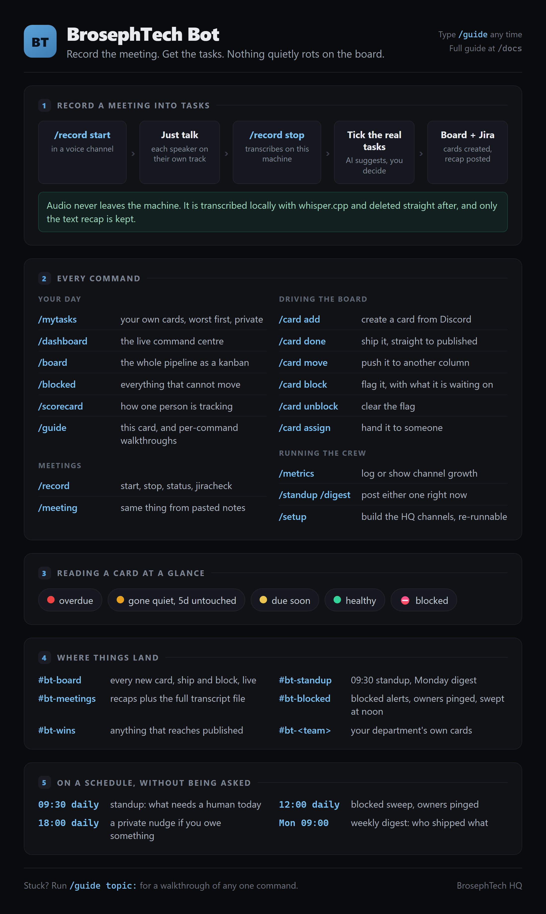
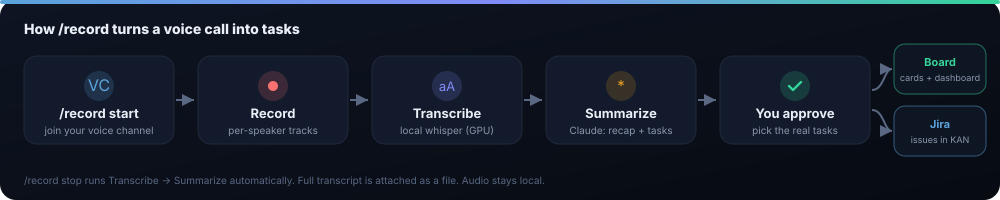
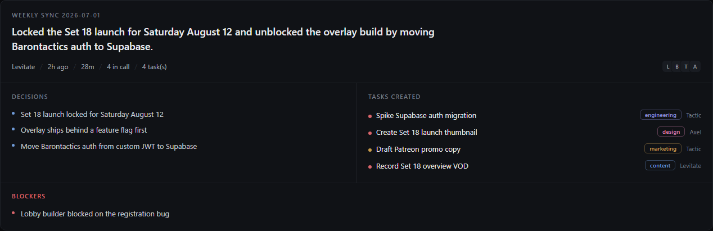

# BrosephTech Bot - Team Guide

This bot lives in our Discord. It records voice meetings, writes a clean recap,
turns the action items into tasks (board + Jira), keeps the board honest, and
shows everything on a live dashboard.

> **In Discord, just run `/guide`.** It posts a one page cheat sheet plus a
> dropdown with a walkthrough of every part. `/guide share:true` posts it for the
> whole channel, which is the fastest way to onboard someone new.



---

## 1. Record a meeting

The headline feature. Hop in a voice channel, run two commands, done.



1. **Join a voice channel** and type **`/record start`**. Everyone who talks is
   recorded on their own track, so a long call is never cut off after a pause.
2. **Have your meeting.** Talk normally. `/record status` shows who it has heard.
3. **Type `/record stop`** (optionally `/record stop title:Weekly sync`). It
   transcribes locally (audio never leaves the machine), then writes the recap
   with AI. A long meeting takes a couple of minutes.
4. **Pick the real tasks** from the checklist and hit **Create selected**. They
   become board cards and Jira issues, and the full recap posts to `#bt-meetings`
   with the complete transcript attached as a file.

> Transcription is local. Audio and intermediate files are deleted right after,
> and only the text recap and transcript are kept.

---

## 2. Reading a card

Every command uses the same five status glyphs, so you learn them once.

| Glyph | Means |
|---|---|
| 🔴 | **Overdue.** The due date passed and the card is not finished. |
| 🟠 | **Gone quiet.** Untouched in the same column for 5 days or more. |
| 🟡 | **Due soon.** Landing within 2 days. |
| 🟢 | **Healthy.** Moving, on time. |
| ⛔ | **Blocked.** Cannot move until somebody clears it. Always sorts first. |

The colour strip down the left of a card carries the same meaning: red needs you
today, amber is a warning, green is fine. Dates render in **your** timezone, so
"in 2 days" means two days for you.

---

## 3. Driving the board from Discord

You no longer need the web board to do your day. Every card verb has
autocomplete: start typing the title and pick it from the list.

| Command | What it does |
|---|---|
| `/card add` | create a card in Ideas, with department, owner, priority, due date |
| `/card done` | move it to Published (the win posts itself to `#bt-wins`) |
| `/card move` | move it to any column |
| `/card block reason:...` | flag it and record what it is waiting on |
| `/card unblock` | clear the flag |
| `/card assign` | hand it to someone |

Autocomplete is filtered per verb: `/card done` only offers open cards,
`/card unblock` only offers blocked ones. Moving a card restarts its staleness
clock, so something you just touched never reads as stuck.

---

## 4. What you get back from a meeting

A structured recap you can skim, in two places: a card in `#bt-meetings` (the
permanent record) and the top of the dashboard.



- **TL;DR** the one line that says what the meeting settled.
- **Decisions** the firm calls the team committed to.
- **Next steps** and **Blockers**.
- **Board cards** and **Jira** issues that were created, with links.
- **Full transcript** attached to the `#bt-meetings` post as a file.

---

## 5. The dashboard

Two views of the same numbers.

**In Discord:** `/dashboard` posts a four part report: a hero card with the
verdict and the counters, **Do next** (ranked worst first), **Where the work
sits** (department load, who is behind, the pipeline), and **Context** (latest
meeting, Jira). It has a Refresh button.

**In a browser:** a live, read-only view that auto-refreshes every 20 seconds.
Open the link Lodie shares (it looks like
`https://<something>.trycloudflare.com/?k=YOUR_TOKEN`); after the first visit it
remembers you. Works on your phone.

> The dashboard is for **seeing**. To **do** things, use the Discord commands.

---

## 6. Commands

| Command | What it does |
|---|---|
| `/guide` | this guide, in Discord, with per-topic walkthroughs |
| `/mytasks` | your own cards, worst first, private, opens with the one to start on |
| `/dashboard` | the live command centre, with a Refresh button |
| `/board` | the whole pipeline as a kanban |
| `/blocked` | everything that cannot move |
| `/scorecard` | one person's accountability standing |
| `/record` | `start` `stop` `status` `jiracheck` |
| `/meeting` | same as a recording but from pasted notes |
| `/card` | `add` `done` `move` `block` `unblock` `assign` |
| `/metrics` | `log` or `show` channel growth, with a trend sparkline |
| `/standup` `/digest` | post either one right now |
| `/setup` | build the HQ channels, safe to re-run |

---

## 7. What runs on its own

| When | What |
|---|---|
| 09:30 daily | standup: the verdict for the day and everything that needs a human |
| 12:00 daily | blocked sweep, owners pinged |
| 18:00 daily | a private nudge, only if you actually owe something |
| Monday 09:00 | weekly digest: who shipped what |

A clean week means silence. Nudges only go to people with something overdue or
gone quiet.

---

## 8. Where your stuff lands

| Thing | Where it goes |
|---|---|
| Meeting recap | `#bt-meetings` (card + transcript file) and the dashboard |
| Tasks you approve | the board (Ideas) and Jira, with links back |
| New cards / ships / blocks | announced live in the HQ channels |
| Standup and digest | the standup channel, on a schedule and on demand |

---

## 9. FAQ

**The bot says "Transcribing..." for a while. Stuck?** No, a long meeting takes a
couple of minutes to transcribe, then a few seconds to summarize. Over 5 minutes,
ping Lodie.

**No tasks from my meeting?** If there were no clear action items it still posts
the recap with no tasks. If summaries look basic, the AI key may be missing.

**Recap looks cut off in Discord?** The embed shows highlights; the full
transcript is attached to the `#bt-meetings` post.

**A list says "and 4 more".** Discord caps how much fits in one card, so the bot
always shows whole rows and tells you how many it dropped rather than cutting a
name in half. Use the web dashboard for the full list.

**Dashboard asks for a token?** Open the full link Lodie shared (ends in `?k=...`).

**Can I change a task from the dashboard?** The web dashboard is read-only. Use
the `/card` commands in Discord, or Jira.

**Does it always listen?** No. Only between `/record start` and `/record stop`,
and the audio is processed locally and deleted right after.

---

## For Lodie (setup)

Config is in `bt-bot/.env`; restart to apply. Keys: `ANTHROPIC_API_KEY` (recaps),
`WHISPER_CMD`/`WHISPER_MODEL` (local transcription), `JIRA_*` (push to Jira),
`DASHBOARD_TOKEN` (web dashboard), `BT_BRAND_NAME` (the crew-facing name used in
every card). Share the dashboard with `npm run tunnel`.

Regenerate the guide poster after editing `docs/guide-card.html` or the topics in
`commands/guide.js`:

```
npm run guide:render
```

Look at every card without posting to Discord (writes `docs/images/embed-preview.png`):

```
npm run preview
```

Full setup in [`../README.md`](../README.md).
