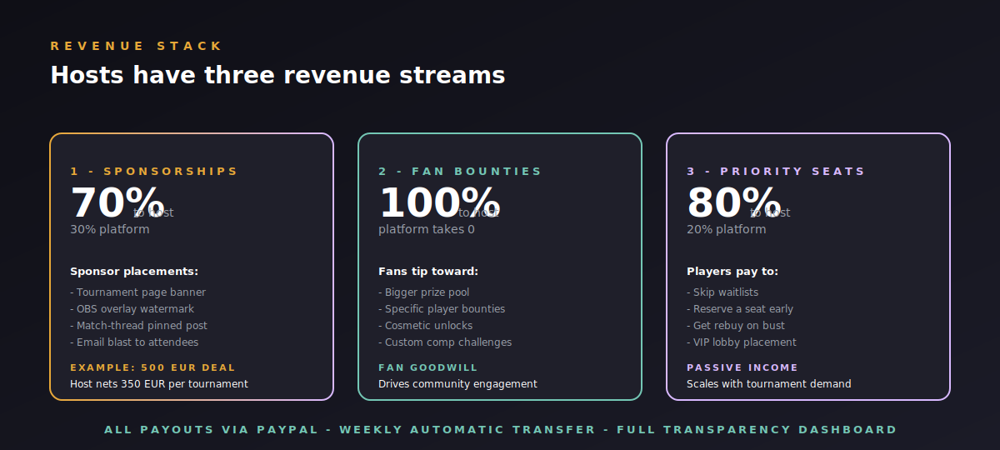

# TFT Clash - Host Handbook

> This handbook is for current and prospective hosts. It explains what TFT Clash gives you, how to run a tournament end-to-end, where the money comes from, and the operational basics. Forward it freely.

---

## Why host on TFT Clash

You're running tournaments anyway. Discord posts, Sheets brackets, manual check-ins, screenshot uploads, drama over scoring. TFT Clash collapses that into one branded page that:

- **Looks like yours, not ours.** Every host gets a branded tournament page with your name, logo, sponsor placement, and prize pool front and center. Players land on a page that feels like *your* event, not a generic platform.
- **Runs itself once it's live.** Registration, waitlist, check-in, lobby seeding, scoring, tiebreakers, and the final podium are all automatic. Your job during the tournament is to stream and hype, not to chase scores.
- **Pays you, not us.** You take the lion's share of every revenue stream you bring in (see the Revenue section below). The platform fee covers infra, payment processing, and support - that's it.
- **Comes with a built-in audience.** Players already on the platform see your tournament in the public events feed, the calendar, and the search index. You don't have to bring your own crowd from zero.

If you've ever lost an evening to a bracket dispute, missed a sponsor commitment because of a UI glitch, or been embarrassed by a clunky-looking event page, this is for you.

---

## What you get for $19.99 / month

The Host plan is one flat fee. No per-tournament charges, no per-player charges, no surprise invoices.

### Tournament tools

- **Branded tournament builder.** Custom name, banner, prize pool, format (single-day clash, multi-stage, flash, scrim, etc.), region, and host bio.
- **Multi-stage brackets.** Group stage into top-cut into finals - all auto-advancing. Or single-stage if you keep it simple.
- **Tournament templates.** Save a config once (8-player single round, 16-player double cut, etc.), spin up future events in one click.
- **Auto-scheduler.** Recurring weekly/monthly tournaments fire automatically. Set it, forget it, the registration pages are pre-built.
- **Custom prize pool.** Cash, credits, items, or "winner picks" - whatever you want, displayed prominently with your branding.

### Live operations

- **Real-time bracket.** Players see seeding, scores, and rank movement instantly. Built on Supabase realtime.
- **OBS overlay built-in.** Add `https://tftclash.com/obs/<your-tournament-id>` as a Browser Source and you've got a transparent live overlay with phase, round, and lobby placements. Theme + filter via querystring.
- **Lobby manager.** Drag-drop seeding, lock placements per round, override scores when needed.
- **Auto-scoring.** Players or hosts enter placements; the platform computes points using the [official EMEA system](#scoring-summary) and resolves tiebreakers automatically.
- **Match thread.** Per-tournament chat board so spectators and players can talk live. Cross-tab synced.
- **Live odds.** Computed win-probability bar for the locked roster - good filler for streams and pre-game hype.
- **Disqualification + dispute tools.** Mark a player as DQ'd, freeze a placement, override a score - all logged in the audit trail.

### Branding + content

- **Sponsor showcase.** Place a sponsor on the tournament page banner, in the OBS overlay watermark, in the post-event email, and in the public archive forever.
- **Custom domain (coming).** Run tournaments under `events.<yourbrand>.com` if you want to disappear the TFT Clash brand entirely.
- **Subpath multitenancy.** `tftclash.com/<your-slug>` lands on a host-specific landing page with all your past + upcoming events.
- **Auto-generated share cards.** Every player + every podium gets a 1200x630 SVG share card auto-built for socials.
- **Calendar feed.** All your tournaments are exposed via `/api/calendar?host=<you>` as an `.ics` feed - players can subscribe in Google Calendar and never miss one.

### Revenue tools

- **Sponsor marketplace.** List open sponsor slots on the public marketplace; sponsors apply directly through the platform.
- **Bounty system.** Fans tip toward bigger prize pools or specific player bounties - you keep 100%.
- **Priority seats.** Players pay to skip waitlists - 80% to you, 20% platform fee.
- **Weekly automatic payouts.** PayPal-based, full transparency dashboard, taxable receipts.

---

## Tournament lifecycle

Every tournament moves through five phases. The platform handles transitions automatically, but you can override any state from the host dashboard.

### 1. Draft

You fill in the basics: name, date/time, format, region, prize pool, sponsor, banner image. The page is live but unpublished - you can iterate without anyone seeing.

**Time investment:** 5 minutes from a template, 15 minutes from scratch.

### 2. Registration

You hit "Open registration." Players see the tournament in the public events feed; the page accepts signups. Waitlist opens once the seat cap is hit. You can cap by region, rank, or invite-only.

**Time investment:** Zero. Watch the seats fill.

### 3. Check-in

15-minute window before scheduled start. Players confirm they're online and ready; no-shows roll off the roster, waitlist players slot in, lobbies are seeded automatically (or by your custom seeding).

**Time investment:** 15 minutes if anything goes wrong; usually zero.

### 4. Live

Four rounds (configurable). Players play their TFT games; placements get reported either by the player, by your scorekeeper, or via Riot API integration (coming). The bracket auto-advances after each round, and the OBS overlay updates live.

**Time investment:** 60-90 minutes of actual tournament time. You're streaming, not babysitting the bracket.

### 5. Results

Final podium auto-publishes. Top finishers get LP, badges, achievement unlocks. The tournament gets archived to your host page and to the platform Hall of Fame. Sponsor receipts and payouts process automatically within 7 days.

**Time investment:** Zero, unless you want to write a recap post.

---

## Scoring summary

Standard Riot EMEA scoring. 1st = 8 pts, 8th = 1 pt. Tiebreakers cascade as shown above.

You can override scoring per tournament if you want to run something exotic (e.g., chess clock, double-elimination, hyperroll), but the default is what most players expect.

---

## Revenue: where the money comes from

Three streams, three different splits.

### 1. Sponsorships - 70% to you

You bring a sponsor (or use the marketplace). They pay for placement on the tournament page, OBS overlay watermark, post-event email blast, and permanent archive. The platform handles invoicing, tax forms, and the actual transfer. **You keep 70%.**

A typical regional sponsor deal is 250-1500 EUR per tournament. At 1000 EUR per event, twice a month, that's 1400 EUR/month net to you - $19.99/mo subscription pays for itself ~700x over.

### 2. Fan bounties - 100% to you

Fans tip toward a bigger prize pool, a specific player bounty ("first to top-4 wins this comp"), or cosmetic unlocks. **The platform takes 0%.** Pure community goodwill.

This typically caps out at 50-200 EUR per tournament unless you have a viral moment, but it's pure upside and drives engagement.

### 3. Priority queue - 80% to you

Players pay (typically 1-3 EUR) to skip waitlists, reserve seats early, or get rebuy on bust. **You keep 80%, platform takes 20%.**

If a tournament has 50 priority seat sales at 2 EUR each, that's 100 EUR gross / 80 EUR to you. Scales linearly with demand.

### Payouts

- **Weekly cycle.** Every Monday at 00:00 UTC, the prior week's earnings transfer to your linked PayPal account.
- **Full dashboard.** Every transaction is itemized: which tournament, which sponsor/fan/player, which split. Exportable as CSV for your accountant.
- **Taxable receipts.** Platform sends you a quarterly summary you can hand to your tax preparer. EU VAT handled automatically.

---

## How to apply as a host

1. **Sign up as a normal player** at [tftclash.com/signup](https://tftclash.com/signup).
2. **Apply at** [tftclash.com/host/apply](https://tftclash.com/host/apply). One-page form: who you are, what tournaments you've run, what brand you bring.
3. **Get approved within 48 hours.** We do a light vetting pass to confirm you're a real human with real tournament-running experience. Not a hard bar - we approve almost everyone who fills the form honestly.
4. **Subscribe to the Host plan.** $19.99/mo via PayPal. First 30 days are free; cancel anytime; no contracts.
5. **Get your dashboard.** [tftclash.com/host/dashboard](https://tftclash.com/host/dashboard) becomes your command center.

---

## Daily ops checklist

Once you're running:

**Weekly (5-15 minutes total):**
- Check the Host Dashboard for upcoming registrations
- Confirm sponsor placements are scheduled correctly
- Reply to any pending applications or DMs in your tournament channels

**Per tournament (60-90 min):**
- 15 min before: open OBS, confirm overlay loads, confirm check-in is rolling
- During: stream, hype, answer questions in match thread
- After: hit "Publish Results" if it didn't auto-publish (rare), thank sponsors

**Monthly:**
- Review payout dashboard
- Adjust sponsor pricing based on what's selling
- Plan next month's calendar

That's it. The platform does the rest.

---

## What hosts ask before signing up

**Can I run a one-off tournament without a monthly subscription?**
Not currently. The $19.99/mo plan is the only host tier. If you only run a tournament every few months it's still a great deal - one sponsor pays for years. We may add a per-event tier in the future if there's demand.

**What happens if I cancel?**
Your tournaments stay archived publicly forever (good for SEO and your reputation). You lose the ability to create new tournaments and the host-facing dashboard. You can re-subscribe anytime and pick up where you left off.

**Can I use my own scoring rules?**
Yes - you can override the default EMEA scoring per tournament. Custom point values, custom tiebreakers, custom round counts. The bracket UI auto-adapts.

**Can I host outside EMEA?**
Yes. The platform supports every Riot region (NA, EUW, EUNE, KR, BR, LAN, LAS, OCE, JP, RU, TR). Regional restrictions on tournaments are optional.

**Do I need to handle taxes?**
The platform handles VAT for EU and reports gross earnings to you for everything else. You handle income tax in your own jurisdiction. We send a quarterly summary you (or your accountant) can use.

**Do you take a cut of my prize pool?**
No. The prize pool is yours and your sponsors' money - we never touch it. The 70/30 / 80/20 splits apply only to sponsor and priority-seat revenue that *flows through* the platform.

**Can I white-label completely?**
Custom domain support is on the roadmap. Today, every tournament URL is `tftclash.com/<tournament>`, but the page itself can be 95% your branding. Subpath multitenancy means `tftclash.com/<your-slug>/<tournament>` is also live.

**What if I have a dispute with the platform?**
Email lodiestream@gmail.com or DM the platform Discord. Real human, fast response, refund-friendly if we screwed up.

---

## Get help

- **Live ops Discord:** [discord.gg/tftclash](https://discord.gg/tftclash) - host channel is private after approval
- **Email:** lodiestream@gmail.com
- **Status page:** [tftclash.com/status](https://tftclash.com/status) - if something's wrong, check here first

---

## What's next on the roadmap

- Custom domain support (white-label)
- Riot API auto-scoring (no manual placement entry)
- Twitch raid + clip integration
- Multi-host tournaments (co-host with revenue split)
- Tournament series (8-week leagues with cumulative standings)

If you want to influence what ships next, the public roadmap with voting is at [tftclash.com/roadmap](https://tftclash.com/roadmap).

Welcome to the platform.
