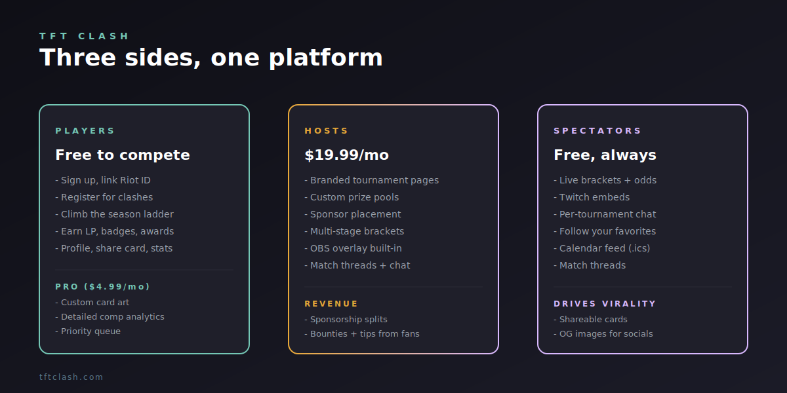
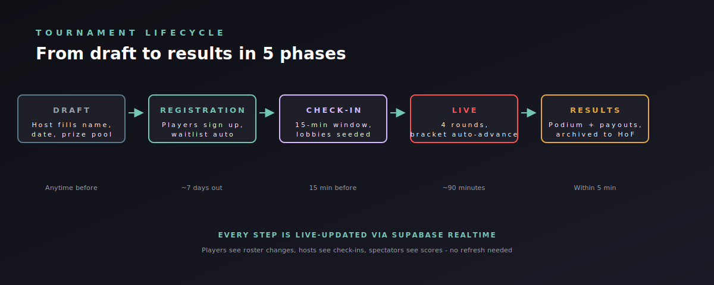
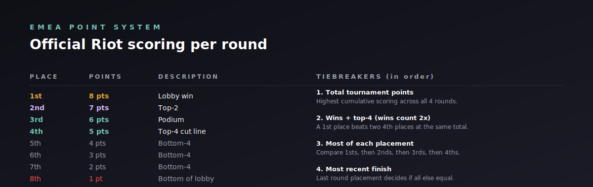

# TFT Clash - Player Handbook

> Everything you need to know to play on TFT Clash. Free to compete, free forever.

---

## What TFT Clash is

TFT Clash is where TFT players compete in scheduled tournaments, climb a season ladder, and build a verifiable competitive record. There's no entry fee. There's no pay-to-win. The free tier gives you everything you need to compete; Pro gives you cosmetic + analytical extras.

You sign up, link your Riot ID, and you can register for any open tournament. Top-4 finishes earn LP. LP determines your season rank. Season rank determines your tier (Spark / Warm / Hot / Blazing / Inferno). At the end of each season, the top finishers get podium awards, custom card art, and bragging rights forever.

That's the whole product, on the player side.

---

## Getting started in 5 minutes

### Step 1 - Sign up

Go to [tftclash.com/signup](https://tftclash.com/signup). Email + password, or one-click via Discord (recommended - your Discord handle becomes your default display name).

### Step 2 - Link your Riot ID

The platform needs to know which Riot account is yours. Go to [tftclash.com/account](https://tftclash.com/account), enter your Riot ID in `Name#TAG` format. The platform uses this to verify rank, surface your match history, and (when Riot API auto-scoring ships) auto-score your tournament games.

### Step 3 - Pick a region

EUW, NA, KR, BR, etc. This restricts you to regional tournaments by default. You can play cross-region but most tournaments are region-locked for ping reasons.

### Step 4 - Browse open tournaments

[tftclash.com/events](https://tftclash.com/events) shows everything coming up. Filter by region, host, format, prize pool. Hit "Register" on any open event.

### Step 5 - Show up and play

15 minutes before scheduled start, the tournament page asks you to check in. Do that. Lobbies seed automatically. Play your TFT games. The bracket updates live.

That's it. You're competing.

---

## How tournaments work

A typical tournament is 4 rounds. You play 4 games in your assigned lobby. Each placement earns points (8 for 1st, 1 for 8th). Highest cumulative score wins.

### Scoring

This is the official Riot EMEA scoring system. Every tournament uses it by default (some custom events may override - the tournament page tells you).

### Tiebreakers

If two players end with the same total points:
1. **Wins + top-4 (wins count 2x).** A 1st place beats two 4th places.
2. **Most of each placement.** Compare 1sts, then 2nds, then 3rds, then 4ths.
3. **Most recent finish.** Last round's placement breaks the tie.

### Phases

- **Registration** - sign up, get your seat.
- **Check-in** - 15-min window before start, confirm you're online.
- **Live** - 4 rounds of TFT, ~75 minutes total.
- **Results** - podium publishes, LP awarded, archive updated.

You only need to be present during check-in and live. The rest happens whether you watch or not.

---

## The season ladder

Every game you play in a sanctioned tournament earns you LP (Ladder Points). LP carries forward all season - it never decays during the season itself. At the end of a season (typically 12 weeks), the LP leaderboard locks, podiums award final tier badges, and a new season starts.

### Tiers

| Tier | LP threshold | Color |
|------|--------------|-------|
| Spark | 0+ | Steel |
| Warm | 100+ | Mint |
| Hot | 250+ | Lavender |
| Blazing | 500+ | Gold |
| Inferno | 1000+ | Red |

Tier shows up next to your name everywhere - leaderboards, podiums, share cards. It's how the community recognizes consistency.

### Daily login streak

There's also a separate daily streak: log in any time during a UTC day to bump your streak by 1. Miss a day, it resets to 1. The streak shows up on your dashboard with the same tier system (Spark -> Warm -> Hot -> Blazing -> Inferno) - this is purely cosmetic but gives long-time players bragging rights.

---

## Your profile

[tftclash.com/player/<your-name>](https://tftclash.com/player/<your-name>) is your public competitive resume. Anyone can view it.

It shows:
- Current season rank, LP, tier
- Lifetime wins, top-4 rate, total games
- Recent battle logs (last 10 games)
- Performance heatmap (last 12 tournaments x 4 rounds, color-coded by points)
- Achievements + badges + weird stat awards (e.g., "Most Late Comebacks", "Greediest Reroller")
- Linked socials (Twitch, Twitter, YouTube)
- Live Twitch embed if you're streaming

You can:
- Customize your bio + banner
- Choose which stats are visible
- Set socials to be visible or hidden
- Generate a share card via the **Share Card** button (1200x630 SVG perfect for Twitter/Discord)

### Followers + rivals

On any other player's profile you can hit **Follow** (you're a fan) or **Mark Rival** (this person beats you and you're personally invested in changing that). Both flags surface back on your dashboard so you see their tournament results first. Stored locally - no DB schema, completely private to your browser.

---

## Free vs Pro

| Feature | Free | Pro ($4.99/mo) |
|---------|------|----------------|
| Compete in tournaments | Yes | Yes |
| Public profile + share card | Yes | Yes |
| Season ladder + tiers | Yes | Yes |
| Followers + rivals | Yes | Yes |
| Match history | Last 10 | Lifetime |
| Performance heatmap | Last 12 tournaments | Lifetime + filterable |
| Comp analytics | Basic | Detailed (units, items, traits) |
| Priority queue access | No | Yes |
| Custom card art | No | Yes |
| Tournament rebuy | No | 1/tournament |
| Profile customization | Basic | Full (banner, theme, badges) |

Free is genuinely competitive. Pro is for people who want deeper analytics or cosmetic flex. Don't feel pressured - we'd rather have 10000 free players than 1000 paying players who feel forced.

---

## Things to do beyond competing

- **Subscribe to the calendar feed.** Click "Subscribe" on the Events page - tournament dates auto-sync to Google Calendar / Apple Calendar.
- **Watch live brackets.** Even if you're not playing, the bracket page shows live updates with odds, points, and round-by-round drama.
- **Use match threads.** Per-tournament chat boards let you trash-talk + hype during live events.
- **Browse the Hall of Fame.** Past season champions and tournament winners are immortalized - your name could be next.
- **Apply to host.** If you've run tournaments before, the Host plan ($19.99/mo) is detailed in [HOST_HANDBOOK.md](./HOST_HANDBOOK.md).

---

## FAQs

**Is this free to play?**
Yes. Always. No entry fees, no pay-to-win, no hidden costs. Pro is optional cosmetics + analytics.

**Do I need a high rank to compete?**
No. Tournaments are split by rank tier when there's enough interest, but most tournaments accept all ranks. If you're new, look for "Open" or "Bronze-Diamond" tagged events.

**Can I play if I'm not in EMEA?**
Yes. The platform supports every Riot region. Pick your region in account settings; you'll see tournaments for that region by default.

**What happens if I no-show a tournament?**
You roll off the roster after check-in window expires. Repeated no-shows (3+ in 30 days) trigger a temporary registration block. Just unregister if you can't make it - that's free and zero-penalty.

**What if I dispute a placement?**
The match thread is the first place to raise it. The host has dispute tools and can override placements. If the host won't act, email lodiestream@gmail.com - we have audit logs of every score change.

**Can I see my whole match history?**
Free tier shows last 10 games. Pro shows lifetime. All games are logged regardless of plan, so upgrading later unlocks the backlog.

**How do I get featured in the Hall of Fame?**
Top-3 in any season, win 5+ tournaments, or hit a milestone (100 games, 50 top-4s, etc.). Everything you do earns toward something.

**Can I play in multiple tournaments per night?**
Yes if their schedules don't overlap. Two events at the same time will show a conflict warning.

**What's the difference between flash, scrim, and clash tournaments?**
- **Clash** - the scheduled weekly main event, full prize pool, ranked LP.
- **Flash** - quick 4-round events, often spontaneous, smaller prizes, partial LP.
- **Scrim** - practice events, no LP, casual atmosphere, often hosted by community streamers.

---

## Get help

- **Discord:** [discord.gg/tftclash](https://discord.gg/tftclash) - real-time community + host support
- **Email:** lodiestream@gmail.com
- **FAQ:** [tftclash.com/faq](https://tftclash.com/faq) - more detailed answers
- **Rules:** [tftclash.com/rules](https://tftclash.com/rules) - the official rulebook

Have fun. Win some lobbies. See you on the bracket.
